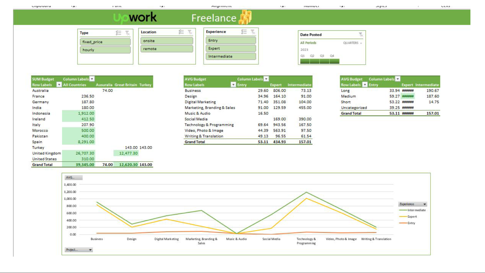

## Freelance Market Dashboard

This project analyzes a global freelancing dataset to explore trends, job categories, and market dynamics for both freelancers and businesses. Built using **Excel + Power Query**, it includes extensive cleaning, transformation, and an interactive dashboard to deliver key insights.

---

### Files Included
- `Freelance_Dashboard.xlsx` – Final dashboard with slicers and KPIs  
- `Original_Dataset.csv` – Raw data  
- `Freelance_Dashboard_Presentation.pdf` – Summary of findings and dashboard walkthrough  

---

### Data Cleaning Highlights
- Standardized country names and job categories  
- Converted currencies and job durations into consistent formats  
- Removed missing or inconsistent values  
- Built slicers and calculated fields using Power Query

---

### Key Insights
- High-paying jobs are concentrated in tech and data fields  
- U.S. and India dominate job volume  
- Short-term jobs are more frequent, but long-term roles offer higher pay  

---

### Recommendations
- Enhance targeting for long-duration job postings  
- Improve job description clarity to reduce mismatches  
- Customize freelancer recommendations by region and category

---

### Tools Used
- Microsoft Excel  
- Power Query  
- PivotTables & Slicers
